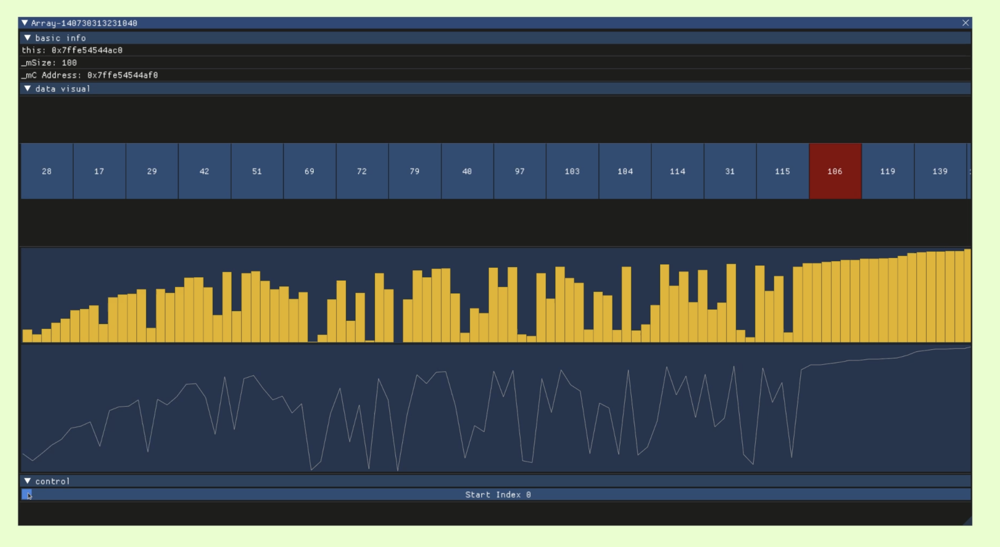

# DSVisual
数据结构可视化库 | a data struct visualization component library base on DStruct

[DStruct](https://github.com/Sunrisepeak/DStruct): 易于移植且结构简洁的数据结构模板库

## 演示/效果/预览

### Array 数组

### EmbeddedList 嵌入式链表

## 开发文档/视频

- [开发日志视频](https://space.bilibili.com/65858958/channel/collectiondetail?sid=1498468)

## Other

- [项目主页](https://github.com/Sunrisepeak/DSVisual)

- [DStruct 数据结构模板库](https://github.com/Sunrisepeak/DStruct)
- [Hanim 动画框架](https://github.com/Sunrisepeak/Hanim)
- [XRecorder 录制库](https://github.com/Sunrisepeak/XRecorder)
