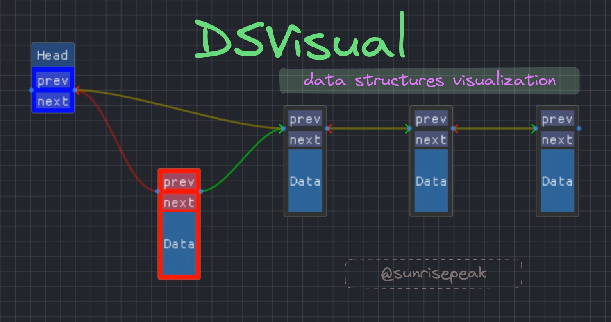

  

<h1></h1>

# DSVisual

🔥基于DStruct的 **数据结构可视化** 库

## 数据结构可视化

### Array 数组 - [代码实现](examples/algo/sort-visualization.cpp)

https://github.com/Sunrisepeak/DSVisual/assets/38786181/744d0aa7-1139-4a6b-8bf6-45cc8a079ea8

### EmbeddedList 嵌入式链表 - [代码实现](examples/ds/embedded_list.cpp)

https://github.com/Sunrisepeak/DSVisual/assets/38786181/fcf136ff-d088-48d1-b860-1ba5bbe8fdf0

## 开发日志

- [开发日志视频](https://space.bilibili.com/65858958/channel/collectiondetail?sid=1498468)

## Other

- [项目主页](https://github.com/Sunrisepeak/DSVisual)
- [DStruct 数据结构模板库](https://github.com/Sunrisepeak/DStruct)
- [Hanim 动画框架](https://github.com/Sunrisepeak/Hanim)
- [XRecorder 录制库](https://github.com/Sunrisepeak/XRecorder)
